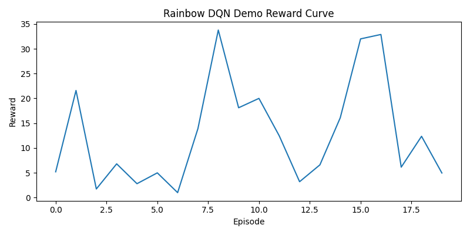

# Highway Reinforcement Problem — ML Portfolio Demo

## 🚗 Overview
This repository contains industry-ready implementations of advanced RL algorithms for the Highway environment. Use the Streamlit demo app to instantly visualize how A3C, Rainbow DQN, and Decision Transformer models learn to drive.

## 📁 Repo Structure

| Folder/File               | Purpose                                           |
|---------------------------|--------------------------------------------------|
| agents/                   | Modular RL agent code                            |
| environments/             | Env setup/config utilities                       |
| utils/                    | Training, plotting, helper scripts               |
| demo/sample_results/      | Pre-generated images/GIFs for recruiter demos    |
| docs/                     | Architecture diagrams, extra docs                |
| notebooks/                | Experiment notebooks                             |
| streamlit_app.py          | Interactive demo app for recruiters              |
| requirements.txt          | All project dependencies                         |
| README.md                 | This file                                        |

## 🚀 Quick Start

1. Clone repo  
2. `pip install -r requirements.txt`
3. `streamlit run streamlit_app.py`  
4. Point and click through the demo — see reward curves, test all RL agents, export results!

## 🔗 Useful Links
- [LinkedIn](your-link-here)
- [Resume (PDF)](your-link-here)
- [Agent architecture diagram](docs/architecture.png)
- [Demo GIF](demo/sample_results/demo_gif.gif)

## 📊 Screenshots

## 👨‍💻 Agents Available

- **A3C**  
- **Rainbow DQN**  
- **Decision Transformer**  

## 📝 Notebooks

See `notebooks/Train.ipynb` for full experiment and training walkthrough.